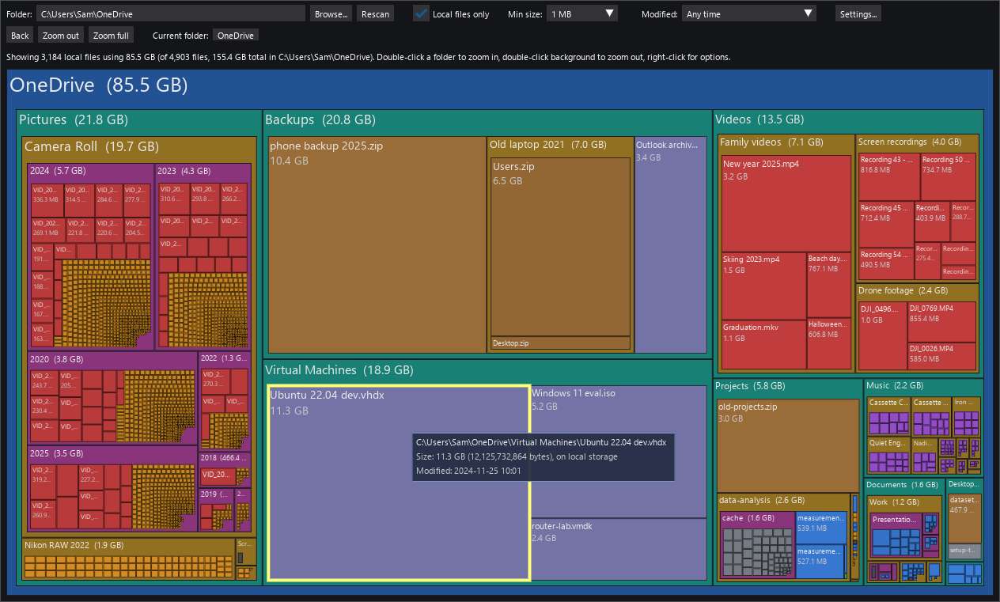

# Unhog

Reclaim space on your disk hogged by OneDrive, Dropbox, SharePoint offline files.

Unhog draws a SpaceMonger-style treemap of the files in a cloud-synced folder
that actually occupy local disk space. "Files On-Demand" keeps most files
online-only; Unhog shows only the hydrated ones, so you can see where the
local space goes and free it up.



The treemap fills in while the folder is being scanned, so large folders can
be explored right away, with a progress bar showing how far the scan has got.
Optionally the free space on the drive is drawn next to the folder, on the
same scale, to show how much the local copies matter.

## Download

**[Download Unhog.zip (latest release)](https://github.com/lassoan/unhog/releases/latest/download/Unhog.zip)**

Requires Windows 10 or 11. No installation needed. All releases, with release
notes, are listed on the [releases page](https://github.com/lassoan/unhog/releases).
Each release also offers `Unhog.exe`, the same program packed into a single
file; it is handy for copying around, but Windows Defender is more likely to
mistrust it, so the zip is the recommended download.

The files are not code-signed. When you run Unhog the first time, Windows
SmartScreen may show "Windows protected your PC". Click **More info**, then
**Run anyway**. If Defender removes the file as a suspected threat instead
(a false positive that new unsigned programs sometimes trigger), open Windows
Security, *Protection history*, find the entry and choose *Restore* or
*Allow*.

## Run

Unzip `Unhog.zip` anywhere, for example into your Documents or
Downloads folder. This creates a folder named `Unhog`. Open it and double-click
`Unhog.exe`. It scans your OneDrive folder and shows the treemap.

Keep `Unhog.exe` together with the `_internal` folder next to it; the program
does not run if the exe is copied out on its own. To put it on the desktop or
Start menu, right-click `Unhog.exe` and create a shortcut.

To scan a different folder, use the **Browse...** button, or start it from a
command prompt with the folder as argument:

```
Unhog.exe D:\Other
```

## Freeing up space

Unhog only shows where the space goes; it does not delete or change anything.
To free the space a file or folder uses, right-click it in Unhog and choose
*Open folder in Explorer* (the item is selected there), then in Explorer
right-click it and choose **Free up space**. The file stays in
the cloud and is downloaded again when you open it. Back in Unhog, right-click
the folder and choose *Rescan* to see the result without scanning everything
again.

## How to use

Hover a rectangle for details, double-click a folder to zoom in, right-click for
options. The toolbar filters by modification time, size and local storage.
All controls and settings are explained in [USAGE.md](USAGE.md).

## How it works

Unhog asks Windows which files in the folder are online-only placeholders and
which are actually present on disk. It reads only the directory listing and
never opens files, so scanning does not download anything.

It is tested with OneDrive, OneDrive for Business (SharePoint), and Dropbox
but it should be compatible with other cloud storage providers as well.

## Privacy

Unhog runs entirely on your PC, does not connect to the internet, and does not
send any information anywhere.

## For developers

Running from source, tests, building the exe and making releases are described
in [DEVELOPMENT.md](DEVELOPMENT.md).

## License

[MIT](LICENSE)
