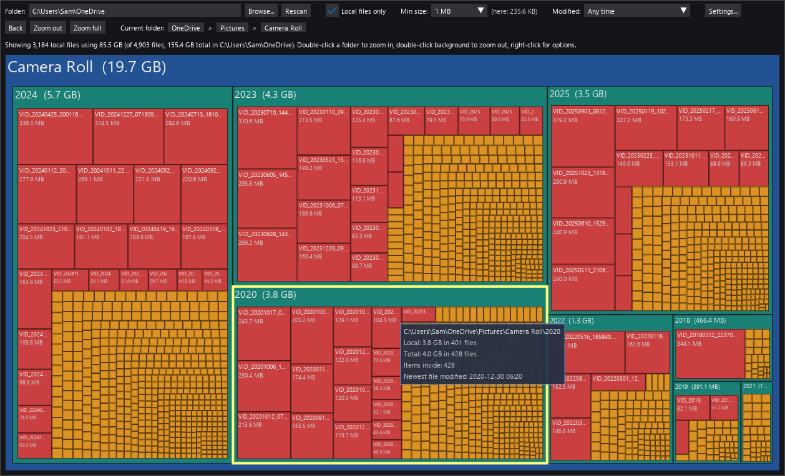
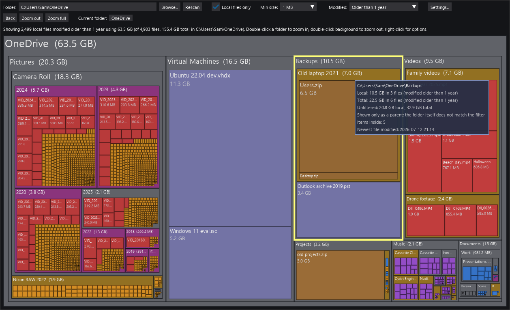
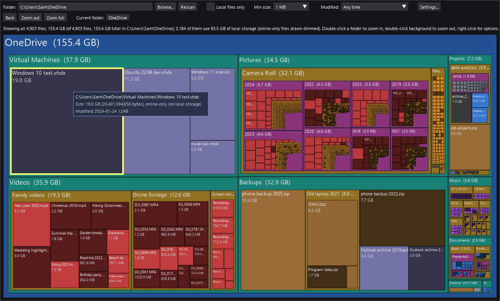
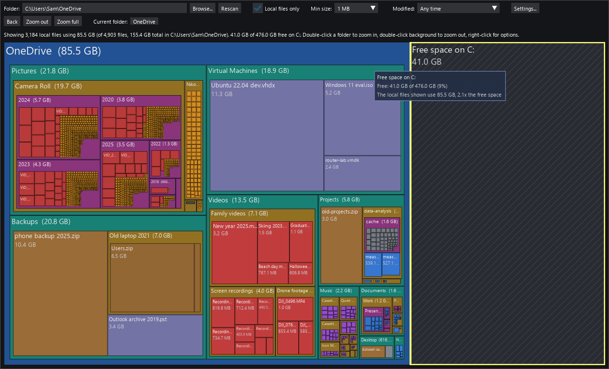

# How to use Unhog

Download and run Unhog as described in [README.md](README.md). This page explains
the controls and settings.

The treemap appears as soon as the scan starts and fills in while it runs; a
progress bar and the status line show how far it has got, and the folder title
says "scanning". You can hover, zoom and use every control before the scan is
finished. Sizes grow until the status line reports the final totals. For a
whole drive (such as `C:\`) the progress bar compares the bytes found with the
drive's used space; for a folder nothing says in advance how big it is, so the
bar is an estimate from the folders found but not yet finished.

- **Hover** a rectangle for its full path, local size and file counts.
- **Double-click a folder** to zoom in: show only that folder's contents.
  Double-click the background (or the current folder's title bar) to zoom out
  one level. The breadcrumb row and the **Zoom out** / **Zoom full** buttons
  navigate too; **Zoom full** returns to the whole scanned folder. **Back**
  (button, or in the right-click menu) returns to the previously shown view,
  step by step.
- **Right-click** an item for a menu: **Back** (when there is a view to
  return to) and *Zoom in* (the same as double-clicking a folder); then *Open
  in Explorer* (folders), *Open folder in Explorer* (a file's folder, or a
  folder's parent with the folder selected), *Copy path* and *Open Properties*
  (the Windows Properties dialog); and *Rescan*, which reads just that folder
  (for a file, its folder) again and updates the treemap in place, handy after
  freeing space in Explorer; and *Hide*, which takes that folder out of the
  treemap (see below); and, for files and folders that use local storage,
  **Free up space** (see below; **Enable modifications** in Settings turns it
  off). Entries that do not apply are left out. **Escape** closes the menu
  (and the Settings window).
- **Hide** (right-click menu, folders only) removes a folder from the display,
  as if it were not there: the folders above it shrink accordingly, so the
  rest of the treemap gets the space and the remaining items can be compared
  without it. Use it to set aside folders that are known and wanted (a photo
  archive, say) and see what else takes up space. Any number of folders can be
  hidden; the status line counts them. While folders are hidden, an
  **Unhide N folders (size)** button appears next to **Zoom full**, showing
  how many folders are hidden and how much space they take together; click it
  to show all of them again. Hidden folders are also left out of scanning:
  hiding a folder while the scan is still inside it stops the scan there at
  once and continues with the rest, which is a quick way to skip a huge folder
  you do not care about, and a right-click *Rescan* of a folder above skips
  hidden folders too. A folder hidden mid-scan is only partly known, so the
  button shows its size with a "+", and **Unhide** scans it properly when it
  brings it back. Nothing is changed on disk, and a new scan (**Browse...**,
  the folder box or the **Rescan** button) starts with nothing hidden.
- **Free up space** (right-click menu, Windows only) does what the command of
  the same name does in Explorer's right-click menu: it marks the file, or the folder
  and everything in it, to be kept online-only. Nothing is deleted. The sync
  client (OneDrive, or any other that uses Windows Files On-Demand) then
  removes the local copies in its own time, usually within seconds, and
  downloads a file again the moment it is opened. Unhog keeps watching the
  marked files and takes each one out of the treemap as soon as it has been
  unloaded, so the folder shrinks while the sync client works; the folder's
  title says "freeing up space..." meanwhile and the status line counts the
  files unloaded so far. When it is over, the status line reports how many
  files and how much space were unloaded, and, if the sync client did not
  unload some of them (it may be paused, or a file may still have changes to
  upload), how many are left; a right-click *Rescan* later shows their
  state. Files marked "Always keep on this device" lose that mark, as in
  Explorer. Hiding, rescanning and zooming are all fine while this runs; a
  new scan (**Browse...**, the folder box or the **Rescan** button) stops the
  watching, and the scan shows the current state.
- On macOS the two Explorer entries read *Open in Finder* and *Open folder in
  Finder*; on Linux, *Open in file manager* and *Open folder in file manager*.
  Linux desktops are asked to show the folder through the standard
  FileManager1 D-Bus interface, which GNOME Files, Dolphin, Nemo, Caja and
  Thunar all support, so the file manager opens even when `xdg-open` would
  send folders to the web browser; `xdg-open` is used only as a last resort.
- **Browse...** / the folder box + **Rescan** scan a different folder.
- **Modified** filters by last-modified time: "Older than …" (1 month to
  5 years) or "Newer than …" (1 week to 1 year). Only matching files count
  toward folder sizes and are drawn; folders act as containers for whatever
  inside them matches. A folder's own time is the newest file anywhere inside
  it (shown in the tooltip), so a folder whose newest file is older than the
  cutoff shows in full under "Older than", while a folder with recent changes
  shows just its old parts and is drawn gray to mark it as a container only.
  The tooltip also shows each file's modification date and the unfiltered
  sizes. Switching does not rescan.
- **Local files only** (checked by default) sizes the treemap by bytes on local
  disk and hides online-only placeholders. Uncheck it to see every file sized by
  its full logical size; online-only files are drawn dimmed. Switching does not
  rescan.
- **Min size** (default 1 MB) hides files and folders smaller than the limit as
  separate rectangles. Within each folder they are folded into one grey
  "N smaller items" tile that carries their combined size, so the parent's area
  stays accurate. Double-click that tile (or right-click it and choose *Zoom
  in*) to view the folded items on their own; the limit shrinks with the
  view, so they appear individually. Right-click the tile to open its folder
  in Explorer. "Off" shows everything. The limit applies to the scanned root: when you drill into
  a folder it shrinks in proportion to that folder's share of the total, so you
  see the same level of detail at every depth. The effective limit for the
  current folder is shown next to the dropdown.

**Settings...** opens a dialog with the appearance settings, followed by an
*About* section with the version, author and website (click the address to
open it in your browser):

- **Scale fonts and padding by folder size** (on by default) grows folder
  titles (and file labels) with the item's share of the folder currently
  shown, from 10 px up to 34 px, so the biggest space hogs jump out. Title
  strips grow to match, and folder frames scale the same way: the folder shown
  gets the full padding, smaller folders get proportionally thinner frames.
- **Padding** (1 px to 32 px, default 12 px) sets how wide the frame is that
  each folder draws around its children.
- **Padding scaling** (Off to Extreme) sets how much thinner the frames of
  smaller folders get: the percentage is what the smallest folders keep of the
  chosen padding, from 100% (uniform) down to 5%. Default is Firm (20%).
  Only applies while scaling by size is on.
- **Show free space on the drive** (off by default) adds a hatched dark tile
  for the free space on the drive the scanned folder is on, sized on the same
  scale as the folder, so you can see at a glance how the space the files take
  compares with what is left on the disk.
  The tile appears only in the top-level view. Hover it for the exact numbers;
  the status line shows them too.
- **Enable modifications** (on by default, Windows only) offers **Free up
  space** in the right-click menu of files and folders that use local
  storage. Everything else Unhog does only reads the disk; this is the one
  command that changes something, and unchecking the setting takes it out of
  the menu, for example on a shared machine or when just looking around. It
  sets the same "keep online-only" mark that Explorer's *Free up space* sets
  and deletes nothing; see the description of the command above.

Files are colored by type (video, image, audio, document, archive, code, disk
image, other) and shaded darker the deeper they sit.

Text and controls follow the Windows display scaling. To make everything
larger or smaller than that, start Unhog with the environment variable
`UNHOG_SCALE` set, for example `set UNHOG_SCALE=1.25` before running it.

Zoomed into a folder, with the tooltip for one of its subfolders:

**Modified** set to "Older than 1 year". Gray folder titles mark folders that
have newer files too and are shown only as containers:

**Local files only** unchecked: every file is sized by its full size and
online-only files are dimmed:

**Show free space on the drive** checked: the free space on drive C: appears
as a hatched tile next to the OneDrive folder, on the same scale:

